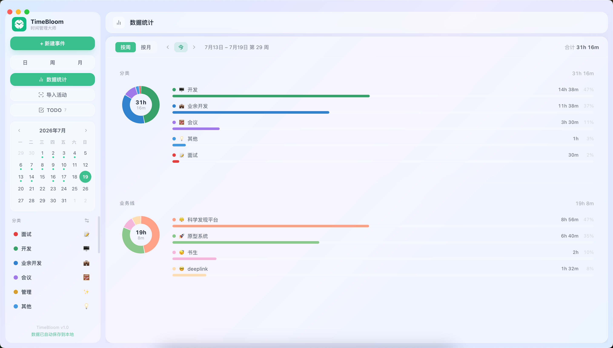

<p align="center">
  
</p>

<h1 align="center">TimeBloom</h1>

<p align="center">把日历、TODO 与本地 Git 活动放在同一个桌面时间轴里。</p>

<p align="center">
  
  
  
  <a href="LICENSE"></a>
</p>

<p align="center">
  
  
</p>


TimeBloom 解决的是工作记录散落的问题：计划在日历里、待办在清单里、实际投入留在 Git 提交里。它将这些信息汇总为可编辑的日/周/月视图，并按分类与业务线统计时间。数据默认保存在本机。

## 功能

- 日、周、月日历与事件管理
- 带优先级、状态、分类、业务线和富文本备注的 TODO
- 扫描本地 Git 提交并导入日历
- 按分类和业务线统计时间投入
- 可选的飞书日历同步

<p align="center">
  
  
  
  
</p>

## 快速开始

需要 Node.js 18+、npm 9+ 与 macOS 10.15+。

```bash
git clone https://github.com/zhangmingemma/TimeBloom.git
cd TimeBloom
npm install
cp .env.example .env
npm run dev
```

不使用飞书同步或自定义 Git 扫描目录时，可以直接启动，无需填写 `.env`。需要配置时，请按 [.env.example](.env.example) 中的注释填写；不要提交 `.env`。

## 打包

```bash
npm run dist
```

安装包会生成在 `release/`。项目目前没有 Apple 代码签名和公证；首次打开可在 Finder 中右键应用并选择“打开”。

## 数据与隐私

- 事件与 TODO 数据保存在 Electron 的本机 `userData` 目录。
- 飞书 OAuth token 保存在同一目录，不进入仓库。
- Git 扫描仅读取你在 `SCAN_ROOT` 指定目录下的提交记录。
- `.env`、构建产物、依赖和本机编辑器配置均已加入 `.gitignore`。

## 技术栈

Electron · React · TypeScript · Vite · Tailwind CSS · Zustand · Tiptap

## 参与贡献

欢迎提交 Issue 或 Pull Request。提交前请运行：

```bash
npm run build
```

## License

[MIT](LICENSE)
